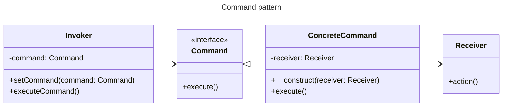

# Patrón de Comportamiento **Command**.

El patrón de diseño **Command** es un patrón de diseño de comportamiento que convierte una solicitud en un
objeto independiente que contiene toda la información sobre la solicitud. Esto permite parametrizar los objetos
con diferentes solicitudes, retrasar o poner en cola la ejecución de una solicitud, y soportar operaciones deshacer.

Elementos del patrón Command:
- **Command (Comando):** Es una interfaz que declara un método `execute()`, que es el metodo que se ejecutará para realizar la acción deseada.
- **ConcreteCommand (Comando Concreto):** Implementa la interfaz `Command` y define la relación entre un objeto Receiver y una acción.
- **Receiver (Receptor):** Conoce cómo realizar las operaciones asociadas a llevar a cabo una solicitud.
- **Invoker (Invocador):** Solicita la ejecución de la solicitud al objeto Command.

#### Diagrama de clases (UML simplificado)



# Ejemplo práctivo

En esta implementación, los roles del patrón Command se distribuyen de la siguiente manera:

- **Client / Invoker (`UserController`):** Actúa como el punto de entrada. Crea el comando concreto y lo invoca inmediatamente.
- **ConcreteCommand (`RegisterUserCommand`):** Encapsula la solicitud y mantiene una referencia al `Receiver` que ejecutará la acción.
- **Receiver (`UserService`):** Es la clase que sabe cómo realizar el trabajo. Contiene la lógica de negocio para registrar un usuario.
- **Dependency (`UserRepository`):** Es una dependencia del `Receiver`, utilizada para la capa de persistencia.

```mermaid
classDiagram
    direction LR

    class Command {
        <<interface>>
        +execute()
    }

    class RegisterUserCommand {
        -UserService service
        -User user
        +__construct(service, user)
        +execute()
    }

    class UserService {
        <<Receiver>>
        -UserRepository repository
        +registerUser(User user)
    }
    
    class UserController {
        <<Client / Invoker>>
        -UserService service
        +registerUser(id, email, password)
    }

    class UserRepository {
        +save(User user)
    }

    ' Relationships
    Command <|.. RegisterUserCommand

    ' UserController (Client) creates the command and invokes it
    UserController ..> RegisterUserCommand : creates
    UserController --> UserService : uses

    ' RegisterUserCommand holds a reference to the Receiver (UserService)
    RegisterUserCommand --> UserService

    ' UserService (Receiver) uses the repository for persistence
    UserService --> UserRepository
```
