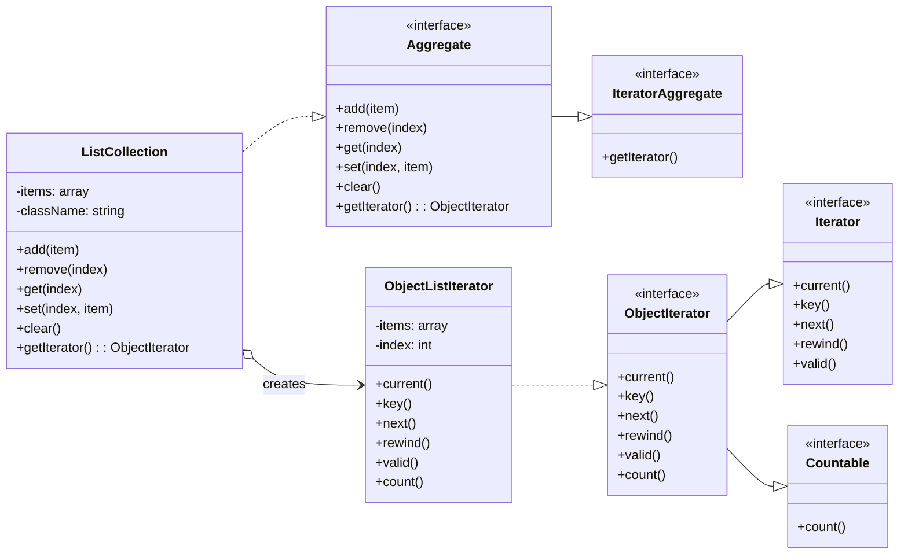

# Patrón de Diseño Iterator (Iterador)

El patrón Iterator es un patrón de comportamiento que permite recorrer los elementos de una colección sin exponer su representación interna (como un array, una lista, un árbol, etc.). Proporciona una forma unificada de acceder a los elementos de un objeto agregado secuencialmente.

## Propósito

*   **Abstracción del recorrido:** Permite acceder a los elementos de un objeto de colección sin necesidad de conocer la estructura subyacente de la colección.
*   **Múltiples recorridos:** Permite que múltiples clientes recorran la misma colección de forma independiente y simultánea.
*   **Interfaz unificada:** Proporciona una interfaz común para recorrer diferentes tipos de colecciones.

## Componentes en esta Implementación

1.  **`Aggregate` (Agregado):** Es una interfaz que extiende la interfaz nativa de PHP `\IteratorAggregate`. Define los métodos que una colección concreta debe implementar, como `add`, `remove`, `get`, `set` y `clear`. Lo más importante es que obliga a implementar el método `getIterator()`, que debe devolver un objeto Iterador.

2.  **`ListCollection` (Agregado Concreto):** Es la implementación de la interfaz `Aggregate`.
    *   Gestiona una colección interna de objetos (en este caso, un array).
    *   Asegura que todos los objetos de la colección sean de un tipo específico, validándolo en el constructor y al añadir nuevos elementos.
    *   Implementa `getIterator()` para devolver una instancia de `ObjectListIterator`, que se encargará del recorrido.

3.  **`ObjectIterator` (Iterador):** Es una interfaz que extiende las interfaces nativas de PHP `\Iterator` y `\Countable`. Define el contrato para los iteradores concretos, asegurando que implementen los métodos necesarios para el recorrido (`current`, `key`, `next`, `rewind`, `valid`) y para contar los elementos (`count`).

4.  **`ObjectListIterator` (Iterador Concreto):** Es la implementación de la interfaz `ObjectIterator`.
    *   Mantiene el estado del recorrido sobre la colección (el índice o cursor actual).
    *   Sabe cómo acceder a los elementos de la colección (`ListCollection`) y cómo avanzar al siguiente.
    *   Cada vez que un cliente solicita un iterador a la colección, se crea una nueva instancia de `ObjectListIterator`, permitiendo recorridos independientes.

## Diagrama de Clases (UML Simplificado)



## Ejemplo de Uso

A continuación, se muestra cómo utilizar la `ListCollection` para crear una colección de objetos `Book` y recorrerla.

```php
<?php

use DesignPatterns\BehaviolarPatterns\Iterator\Entities\Book;
use DesignPatterns\BehaviolarPatterns\Iterator\ListCollection;

// 1. Crear una colección que solo aceptará objetos de la clase Book.
$bookCollection = new ListCollection(Book::class);

// 2. Añadir libros a la colección.
$bookCollection->add(new Book('El Señor de los Anillos', 'J.R.R. Tolkien', 1954));
$bookCollection->add(new Book('Cien Años de Soledad', 'Gabriel García Márquez', 1967));
$bookCollection->add(new Book('1984', 'George Orwell', 1949));

// 3. Obtener el iterador de la colección.
$iterator = $bookCollection->getIterator();

// 4. Recorrer la colección usando el iterador con un bucle while.
echo "Recorrido con bucle while:\n";
while ($iterator->valid()) {
    $book = $iterator->current();
    $key = $iterator->key();
    echo "- Índice {$key}: {$book->getTitle()} ({$book->getAuthor()})\n";
    $iterator->next();
}

// 5. Gracias a la implementación de `IteratorAggregate`, también podemos
//    usar un bucle `foreach` directamente sobre la colección, lo que resulta
//    más limpio y legible.
echo "\nRecorrido con bucle foreach:\n";
foreach ($bookCollection as $key => $book) {
    echo "- Índice {$key}: {$book->getTitle()} ({$book->getAuthor()})\n";
}

?>
```

### ¿Por qué funciona el `foreach`?

El bucle `foreach` de PHP sabe cómo trabajar con objetos que implementan la interfaz `\IteratorAggregate`. Cuando se usa `foreach` sobre `$bookCollection`, PHP llama internamente a su método `getIterator()` para obtener el objeto iterador (`ObjectListIterator`) y luego utiliza los métodos de este (`valid`, `current`, `key`, `next`) para realizar el recorrido, tal como lo hicimos manualmente en el bucle `while`.
