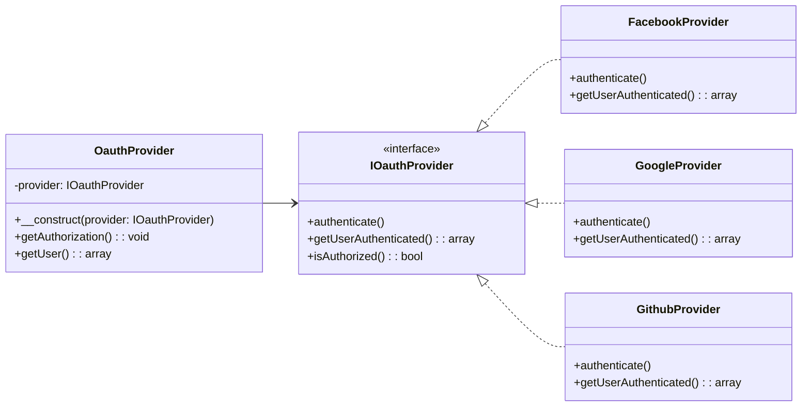

# Patrón Strategy (Estrategia)

## ¿Qué es el Patrón Strategy?

El patrón **Strategy** es un patrón de diseño de comportamiento que permite seleccionar algoritmos sobre la marcha. Define una familia de algoritmos, los encapsula y los hace intercambiables sin alterar el código que los usa.

## Problema que Resuelve

Cuando tienes múltiples formas de realizar una tarea y quieres evitar:
- Largos bloques `if/else` o `switch`
- Código difícil de mantener y extender
- Violación del principio Open/Closed

## Componentes del Patrón

1. **Strategy Interface**: Define la interfaz común para todas las estrategias
2. **Concrete Strategies**: Implementaciones específicas de cada algoritmo
3. **Context**: Clase que usa las estrategias y puede cambiarlas dinámicamente

## Ejemplo: Autenticación OAuth2

### Diagrama de Clases (UML Simplificado)

### Strategy Interface
```php
interface IOauthProvider
{
    public function authenticate(): void;
    public function getUserAuthenticated(): array;
    public function isAuthorized(): bool;
}
```

### Concrete Strategies
```php
class FacebookProvider implements IOauthProvider
{
    public function authenticate(): void
    {
        // Lógica específica de Facebook OAuth
        $this->userAuthenticated = [
            'facebook_access_token' => 'token...',
            'user' => ['email' => '...', 'fullname' => '...']
        ];
    }
}

class GoogleProvider implements IOauthProvider  
{
    public function authenticate(): void
    {
        // Lógica específica de Google OAuth
        $this->userData = [
            'access_token' => 'token...',
            'user' => ['email' => '...', 'name' => '...']
        ];
    }
}

class GithubProvider implements IOauthProvider
{
    public function authenticate(): void
    {
        // Lógica específica de GitHub OAuth
        $this->userAuthenticated = [
            'access_token' => 'gho_...',
            'scope' => 'repo,gist'
        ];
    }
}
```

### Context
```php
readonly class OauthProvider
{
    private IOauthProvider $provider;

    public function __construct(IOauthProvider $provider) 
    {
        $this->provider = $provider;
    }

    public function getAuthorization(): void 
    {
        $this->provider->authenticate(); // Delega a la estrategia
    }

    public function getUser(): array
    {
        return $this->provider->getUserAuthenticated();
    }
}
```

## Uso del Patrón

```php
// Autenticación con Facebook
$facebookAuth = new OauthProvider(new FacebookProvider($credentials));
$facebookAuth->getAuthorization();
$user = $facebookAuth->getUser();

// Cambiar a Google sin modificar código cliente
$googleAuth = new OauthProvider(new GoogleProvider($credentials));
$googleAuth->getAuthorization();
$user = $googleAuth->getUser();

// O usar GitHub
$githubAuth = new OauthProvider(new GithubProvider($credentials));
$githubAuth->getAuthorization();
```

## Ventajas

✅ **Flexibilidad**: Cambio de algoritmos en tiempo de ejecución  
✅ **Extensibilidad**: Fácil agregar nuevas estrategias (Twitter, LinkedIn)  
✅ **Mantenibilidad**: Cada algoritmo está aislado  
✅ **Testabilidad**: Cada estrategia se puede testear independientemente  
✅ **Open/Closed**: Abierto para extensión, cerrado para modificación  

## Cuándo Usarlo

- Tienes múltiples formas de realizar la misma tarea
- Quieres evitar condicionales complejas
- Necesitas cambiar algoritmos dinámicamente
- Cada algoritmo tiene lógica específica compleja

## Caso Perfecto: OAuth2

OAuth2 es ideal para Strategy porque:
- **El flujo general es el mismo**: obtener token, validar, obtener usuario
- **Cada proveedor tiene particularidades**: diferentes endpoints, parámetros, formatos de respuesta
- **Es fácil agregar nuevos proveedores** sin afectar código existente
- **El cliente no necesita conocer** los detalles de cada proveedor
