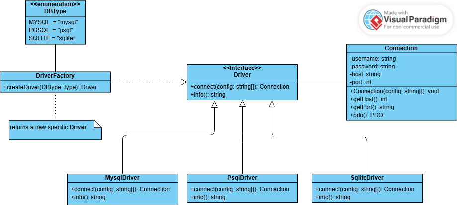

# Patrón de Diseño - Factory Method

## ¿Qué es el patrón Factory Method?

El patrón de diseño Factory Method (o método de fábrica) es un patrón creacional que proporciona una interfaz para crear objetos en una superclase, pero permite a las subclases alterar el tipo de objetos que se crearán. En otras palabras, delega la responsabilidad de la instanciación a las subclases.

## ¿Cuándo usarlo?

Utiliza el patrón Factory Method cuando:

*   No sabes de antemano los tipos y dependencias exactos de los objetos con los que tu código debe funcionar.
*   Quieres proporcionar a los usuarios de tu biblioteca o framework una forma de extender sus componentes internos.
*   Quieres ahorrar recursos del sistema reutilizando objetos existentes en lugar de reconstruirlos cada vez.

## Diagrama de Clases (UML)

## Ejemplo: Conexiones a Bases de Datos

En este proyecto, hemos implementado el patrón Factory Method para crear conexiones a diferentes motores de bases de datos (MySQL, PostgreSQL y SQLite).

### Diagrama de Clases del Ejemplo

### Componentes

*   **`Driver`**: La interfaz del producto, que declara los métodos que todos los productos concretos deben implementar. En nuestro caso, el método `connect()`.
*   **`MysqlDriver`**, **`PsqlDriver`**, **`SqliteDriver`**: Los productos concretos, que son las diferentes implementaciones de la interfaz `Driver`.
*   **`ConnectionFactory`**: La clase creadora (la fábrica), que declara el método de fábrica `getConnection()`. Este método devuelve un objeto que implementa la interfaz `Driver`.
*   **`Connection`**: Una clase auxiliar que representa la conexión a la base de datos.

### ¿Cómo funciona?

1.  El cliente solicita a `ConnectionFactory` una conexión a un tipo de base de datos específico (a través del `enum` `DBType`).
2.  El método `getConnection()` de `ConnectionFactory` utiliza una sentencia `match` para determinar qué clase de `Driver` concreta debe instanciar.
3.  Se crea una nueva instancia del `Driver` seleccionado y se devuelve al cliente.
4.  El cliente puede entonces utilizar el método `connect()` del `Driver` para obtener un objeto `Connection` y empezar a interactuar con la base de datos.

Este enfoque nos permite añadir soporte para nuevos motores de bases de datos en el futuro sin tener que modificar el código cliente. Simplemente tendríamos que crear una nueva clase que implemente la interfaz `Driver` y añadirla a la sentencia `match` en `ConnectionFactory`.
